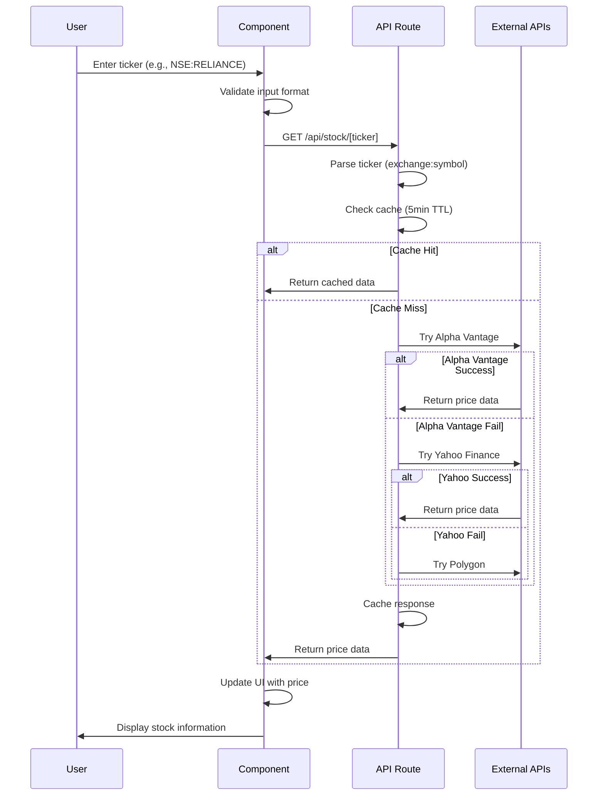
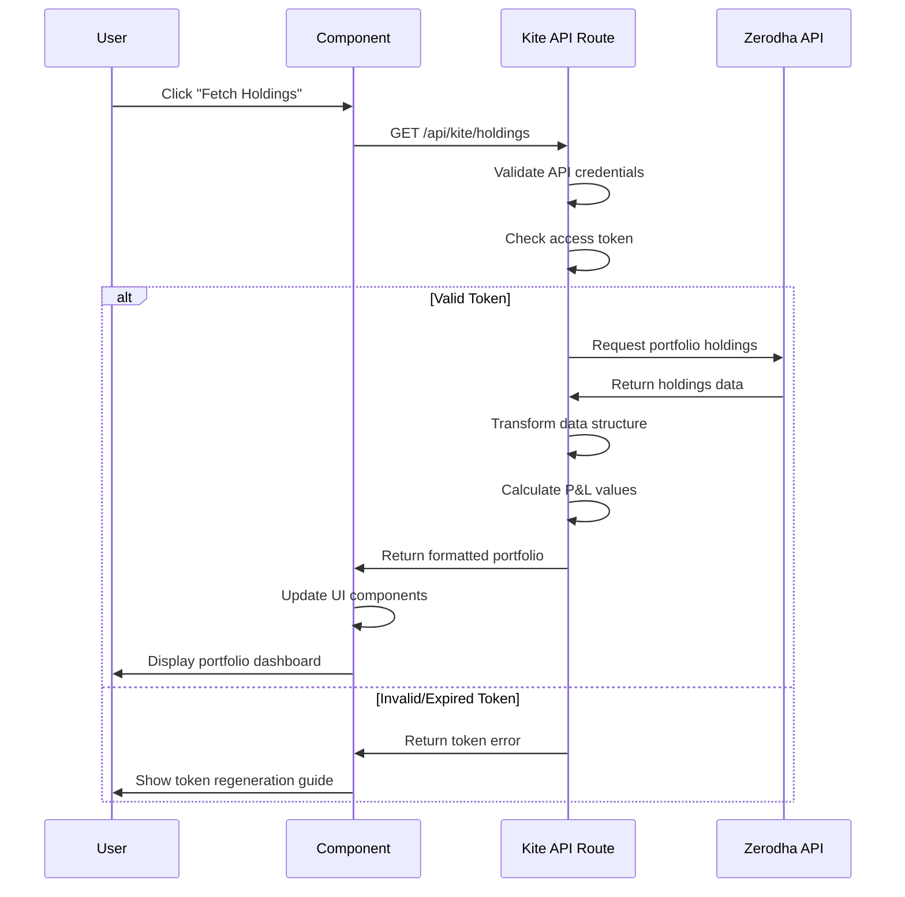

# 🏗️ Application Architecture

## System Overview

This document provides a detailed technical overview of the Stock Portfolio Tracker application architecture, including data flows, API integrations, and component relationships.

## 📊 High-Level Architecture

```
┌─────────────────────────────────────────────────────────────┐
│                    CLIENT (Browser)                         │
├─────────────────────────────────────────────────────────────┤
│  React Components (Next.js 14)                             │
│  ├── StockTableWithKite (Main UI)                          │
│  ├── Manual Stock Tracking                                 │
│  ├── Portfolio Holdings Display                            │
│  └── Real-time Price Updates                               │
└─────────────────────────────────────────────────────────────┘
                              │
                              ▼
┌─────────────────────────────────────────────────────────────┐
│                 NEXT.JS API ROUTES                          │
├─────────────────────────────────────────────────────────────┤
│  /api/stock/[ticker]     │  /api/kite/holdings             │
│  ├── Multi-source fetch  │  ├── Zerodha authentication     │
│  ├── Exchange detection  │  ├── Portfolio data transform   │
│  ├── Price caching      │  ├── P&L calculations           │
│  └── Error handling     │  └── Weight calculations        │
└─────────────────────────────────────────────────────────────┘
                              │
                              ▼
┌─────────────────────────────────────────────────────────────┐
│                 EXTERNAL APIS                               │
├─────────────────────────────────────────────────────────────┤
│  Alpha Vantage  │  Yahoo Finance  │  Polygon  │  Kite API   │
│  ├── US Stocks  │  ├── Global     │  ├── US   │  ├── Holdings│
│  ├── Indian     │  ├── Indian     │  └── Demo │  ├── Positions│
│  └── Demo Mode  │  └── Real-time  │           │  └── Auth    │
└─────────────────────────────────────────────────────────────┘
```

## 🔄 Data Flow Diagrams

### Manual Stock Tracking Flow



### Kite Portfolio Integration Flow



## 🧩 Component Architecture

### Component Hierarchy

```
StockTableWithKite
├── Tabs (Manual | Portfolio | Kite)
│   ├── TabsContent (Manual)
│   │   ├── AddStockDialog
│   │   │   ├── Input (ticker)
│   │   │   ├── Label
│   │   │   └── Button (Add/Cancel)
│   │   ├── StockTable
│   │   │   ├── TableHeader
│   │   │   ├── TableBody
│   │   │   │   └── TableRow[]
│   │   │   │       ├── TableCell (Ticker)
│   │   │   │       ├── TableCell (Price)
│   │   │   │       ├── TableCell (Updated)
│   │   │   │       └── TableCell (Status)
│   │   │   └── Skeleton (Loading)
│   │   └── RefreshButton
│   │
│   └── TabsContent (Kite)
│       ├── PortfolioSummary
│       │   ├── Card (Total Value)
│       │   ├── Card (Total P&L)
│       │   └── Card (Holdings Count)
│       ├── HoldingsTable
│       │   ├── TableHeader
│       │   └── TableBody
│       │       └── TableRow[]
│       │           ├── Stock Info
│       │           ├── Quantity
│       │           ├── Avg Price
│       │           ├── Current Price
│       │           ├── Value
│       │           ├── P&L
│       │           └── P&L %
│       ├── ErrorDisplay
│       └── SetupGuide
```

### State Management

```typescript
// Component State Structure
interface ComponentState {
  // Manual Stocks
  stocks: Stock[];
  isModalOpen: boolean;
  tickerInput: string;

  // Kite Integration
  kiteHoldings: KiteHolding[];
  kiteLoading: boolean;
  kiteError: string | null;
  kiteSetupRequired: boolean;

  // UI State
  activeTab: string;
}

// Data Interfaces
interface Stock {
  ticker: string; // Full ticker (e.g., "NSE:RELIANCE")
  symbol?: string; // Stock symbol (e.g., "RELIANCE")
  exchange?: string; // Exchange (e.g., "NSE")
  price: number; // Current price
  loading?: boolean; // Loading state
  error?: string; // Error message
  lastUpdated?: Date; // Last update timestamp
}

interface KiteHolding {
  ticker: string; // Formatted ticker
  symbol: string; // Stock symbol
  exchange: string; // Exchange
  quantity: number; // Shares held
  averagePrice: number; // Purchase price
  price: number; // Current price
  value: number; // Total value
  pnl: number; // Profit/Loss
  pnlPercent: number; // P&L percentage
  instrument: string; // Kite instrument token
  source: string; // Data source
  lastUpdated: string; // Update timestamp
}
```

## 🔌 API Architecture

### Stock Price API (`/api/stock/[ticker]/route.ts`)

#### Request Processing Pipeline

```typescript
// 1. Ticker Parsing
function parseTicker(input: string) {
  // Handles formats: AAPL, NSE:RELIANCE, NASDAQ:GOOGL
  const [exchange, symbol] = input.includes(":")
    ? input.split(":")
    : ["", input];

  return {
    exchange: exchange || detectExchange(symbol),
    symbol,
    fullTicker: input,
  };
}

// 2. Cache Management
const tickerCache = new Map();
const CACHE_DURATION = 5 * 60 * 1000; // 5 minutes

function getCachedPrice(ticker: string) {
  const cached = tickerCache.get(ticker);
  if (cached && Date.now() - cached.timestamp < CACHE_DURATION) {
    return cached;
  }
  return null;
}

// 3. Multi-Source Data Fetching
async function fetchFromMultipleSources(ticker: string) {
  const sources = [
    () => fetchFromAlphaVantage(ticker),
    () => fetchFromYahooFinance(ticker),
    () => fetchFromPolygon(ticker),
  ];

  for (const source of sources) {
    try {
      const result = await source();
      if (result.valid && result.price) {
        return result;
      }
    } catch (error) {
      console.log(`Source failed: ${error.message}`);
      continue;
    }
  }

  return { valid: false, error: "No data available" };
}
```

#### Exchange-Specific Handling

```typescript
// Exchange Detection and Routing
function routeByExchange(ticker: string, exchange: string) {
  switch (exchange) {
    case "NSE":
    case "BSE":
      return validateIndianStock(ticker, exchange);

    case "NASDAQ":
    case "NYSE":
      return validateUSStock(ticker, exchange);

    default:
      return validateInternationalStock(ticker, exchange);
  }
}

// Indian Stock Handling
async function validateIndianStock(ticker: string, exchange: string) {
  const indianSources = [
    () => fetchFromAlphaVantageIndian(ticker, exchange),
    () => fetchFromYahooFinanceIndian(ticker, exchange),
    () => fetchFromNSEAPI(ticker, exchange),
  ];

  // Try each source with Indian-specific formatting
  // NSE:RELIANCE -> RELIANCE.NS for Yahoo Finance
}
```

### Kite API Integration (`/api/kite/holdings/route.ts`)

#### Authentication Flow

```typescript
import { KiteConnect } from "kiteconnect";

// Initialize Kite Connect
const kite = new KiteConnect({
  api_key: process.env.KITE_API_KEY || "",
});

// Set access token
kite.setAccessToken(process.env.KITE_ACCESS_TOKEN);

// Fetch holdings with error handling
async function fetchHoldings() {
  try {
    const holdings = await kite.getHoldings();
    return transformHoldingsData(holdings);
  } catch (error) {
    return handleKiteError(error);
  }
}
```

#### Data Transformation

```typescript
function transformHoldingsData(rawHoldings: any[]) {
  return rawHoldings.map((holding) => ({
    ticker: `${holding.exchange}:${holding.tradingsymbol}`,
    symbol: holding.tradingsymbol,
    exchange: holding.exchange,
    quantity: holding.quantity,
    averagePrice: holding.average_price,
    price: holding.last_price,
    value: holding.last_price * holding.quantity,
    pnl: (holding.last_price - holding.average_price) * holding.quantity,
    pnlPercent:
      ((holding.last_price - holding.average_price) / holding.average_price) *
      100,
    instrument: holding.instrument_token,
    source: "Zerodha Kite",
    lastUpdated: new Date().toISOString(),
  }));
}
```

## 🎨 UI Architecture

### Design System

```typescript
// Theme Configuration
const theme = {
  colors: {
    primary: "hsl(222.2 84% 4.9%)",
    secondary: "hsl(210 40% 96%)",
    accent: "hsl(210 40% 94%)",
    muted: "hsl(210 40% 96%)",
    success: "hsl(142.1 76.2% 36.3%)",
    destructive: "hsl(0 84.2% 60.2%)",
    warning: "hsl(38.5 92.1% 50.3%)",
  },
  typography: {
    fontFamily: "var(--font-geist-sans)",
    fontSizes: {
      xs: "0.75rem",
      sm: "0.875rem",
      base: "1rem",
      lg: "1.125rem",
      xl: "1.25rem",
      "2xl": "1.5rem",
      "3xl": "1.875rem",
    },
  },
};

// Component Variants
const buttonVariants = {
  default: "bg-primary text-primary-foreground hover:bg-primary/90",
  destructive:
    "bg-destructive text-destructive-foreground hover:bg-destructive/90",
  outline: "border border-input bg-background hover:bg-accent",
  secondary: "bg-secondary text-secondary-foreground hover:bg-secondary/80",
  ghost: "hover:bg-accent hover:text-accent-foreground",
};
```

### Responsive Design

```css
/* Mobile-first approach */
.portfolio-grid {
  @apply grid grid-cols-1 gap-4;
}

/* Tablet */
@media (min-width: 768px) {
  .portfolio-grid {
    @apply grid-cols-2;
  }
}

/* Desktop */
@media (min-width: 1024px) {
  .portfolio-grid {
    @apply grid-cols-3;
  }
}

/* Table responsiveness */
.stock-table {
  @apply overflow-x-auto;
}

@media (max-width: 640px) {
  .stock-table th,
  .stock-table td {
    @apply text-sm px-2;
  }
}
```

## 🔒 Security Architecture

### API Security

```typescript
// Environment Variable Validation
function validateEnvironment() {
  const required = ["KITE_API_KEY", "KITE_API_SECRET", "KITE_ACCESS_TOKEN"];

  for (const key of required) {
    if (!process.env[key]) {
      throw new Error(`Missing required environment variable: ${key}`);
    }
  }
}

// Request Validation
function validateRequest(req: NextRequest) {
  // Rate limiting
  const clientIP = req.ip || "unknown";
  if (isRateLimited(clientIP)) {
    return NextResponse.json({ error: "Rate limit exceeded" }, { status: 429 });
  }

  // Input sanitization
  const ticker = req.nextUrl.pathname.split("/").pop();
  if (!isValidTicker(ticker)) {
    return NextResponse.json(
      { error: "Invalid ticker format" },
      { status: 400 }
    );
  }
}
```

### Data Privacy

```typescript
// No sensitive data logging
function logRequest(ticker: string, success: boolean) {
  console.log({
    timestamp: new Date().toISOString(),
    ticker: ticker.replace(/[^A-Z:]/g, ""), // Sanitize
    success,
    // Never log: API keys, tokens, user data
  });
}

// Secure error responses
function sanitizeError(error: any) {
  return {
    message: error.message || "An error occurred",
    // Never expose: stack traces, internal paths, credentials
  };
}
```

## 📈 Performance Architecture

### Caching Strategy

```typescript
// Multi-level caching
class CacheManager {
  private memoryCache = new Map();
  private readonly TTL = 5 * 60 * 1000; // 5 minutes

  get(key: string) {
    const entry = this.memoryCache.get(key);
    if (entry && Date.now() - entry.timestamp < this.TTL) {
      return entry.data;
    }
    this.memoryCache.delete(key);
    return null;
  }

  set(key: string, data: any) {
    this.memoryCache.set(key, {
      data,
      timestamp: Date.now(),
    });
  }

  // Cleanup expired entries
  cleanup() {
    const now = Date.now();
    for (const [key, entry] of this.memoryCache.entries()) {
      if (now - entry.timestamp >= this.TTL) {
        this.memoryCache.delete(key);
      }
    }
  }
}
```

### Loading Optimization

```typescript
// Component lazy loading
const LazyPortfolioChart = lazy(() => import("./PortfolioChart"));

// Image optimization
<Image
  src="/placeholder.svg"
  alt="Stock chart"
  width={400}
  height={300}
  priority={false}
  placeholder="blur"
/>;

// Code splitting
const dynamic = () => import("./HeavyComponent");
```

## 🔧 Build Architecture

### Next.js Configuration

```javascript
// next.config.mjs
const nextConfig = {
  // Build optimizations
  experimental: {
    optimizePackageImports: ["lucide-react", "@radix-ui/react-*"],
  },

  // Image optimization
  images: {
    domains: ["example.com"],
    formats: ["image/webp", "image/avif"],
  },

  // Bundle analysis
  webpack: (config, { isServer }) => {
    if (!isServer) {
      config.resolve.fallback = {
        fs: false,
        net: false,
        tls: false,
      };
    }
    return config;
  },
};
```

### TypeScript Configuration

```json
{
  "compilerOptions": {
    "target": "ES2017",
    "lib": ["dom", "dom.iterable", "es6"],
    "allowJs": true,
    "skipLibCheck": true,
    "strict": true,
    "forceConsistentCasingInFileNames": true,
    "noEmit": true,
    "esModuleInterop": true,
    "module": "esnext",
    "moduleResolution": "bundler",
    "resolveJsonModule": true,
    "isolatedModules": true,
    "jsx": "preserve",
    "incremental": true,
    "plugins": [
      {
        "name": "next"
      }
    ],
    "baseUrl": ".",
    "paths": {
      "@/*": ["./*"]
    }
  },
  "include": ["next-env.d.ts", "**/*.ts", "**/*.tsx", ".next/types/**/*.ts"],
  "exclude": ["node_modules"]
}
```

## 🚀 Deployment Architecture

### Vercel Deployment

```yaml
# vercel.json
{
  "buildCommand": "pnpm build",
  "devCommand": "pnpm dev",
  "installCommand": "pnpm install",
  "framework": "nextjs",
  "regions": ["bom1", "sin1"], # Asia-Pacific regions
  "functions": { "app/api/**/*.ts": { "maxDuration": 10 } },
  "headers":
    [
      {
        "source": "/api/(.*)",
        "headers":
          [
            {
              "key": "Cache-Control",
              "value": "s-maxage=300, stale-while-revalidate",
            },
          ],
      },
    ],
}
```

### Environment Management

```bash
# Production Environment
ALPHA_VANTAGE_API_KEY=prod_key
KITE_API_KEY=prod_kite_key
KITE_API_SECRET=prod_kite_secret
KITE_ACCESS_TOKEN=prod_access_token

# Development Environment
ALPHA_VANTAGE_API_KEY=demo
KITE_API_KEY=dev_kite_key
KITE_API_SECRET=dev_kite_secret
KITE_ACCESS_TOKEN=dev_access_token
```

This architecture provides a solid foundation for a scalable, maintainable, and secure stock portfolio tracking application with real-time data integration and professional-grade user experience.
